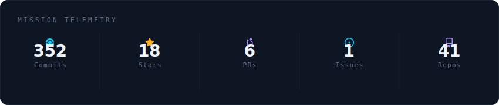

  

 

  

 

  

 

  

 

<strong>More about me</strong>

 

[cite_start]Technology professional with deep experience in full-stack development, data security, and microservices architecture[cite: 4, 5].
[cite_start]Experienced in infrastructure orchestration, DevOps, CI/CD pipeline management, and Kubernetes[cite: 6].
[cite_start]Proficient in C#/.NET, JavaScript/TypeScript, Python, Golang, & PHP[cite: 7].

[cite_start]**Currently at** CI&T — Campinas (Remote) [cite: 14]

 

  
  

